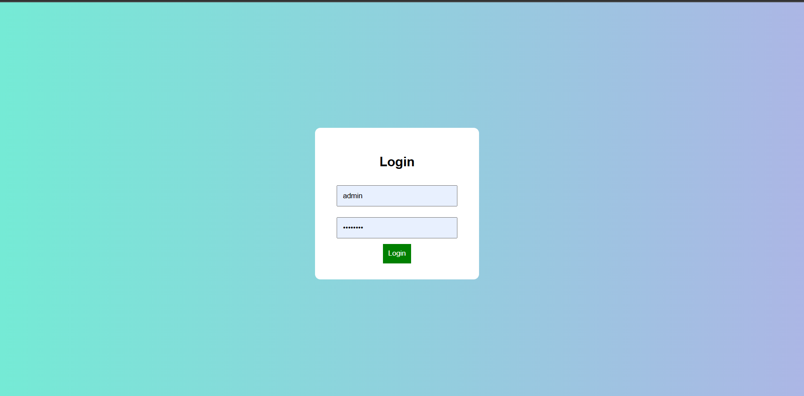
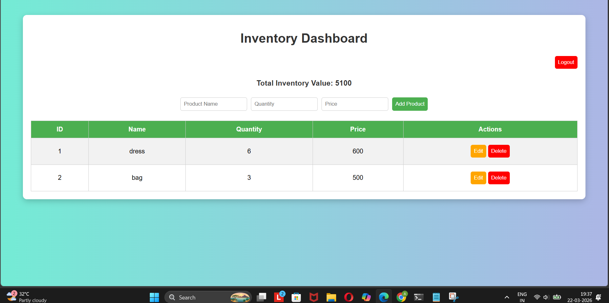

# Inventory Management System

A **Flask + MySQL Inventory Management System** with secure login, dashboard, add/edit/delete products, and total inventory value tracking.  
This project is perfect for learning Flask, MySQL integration, and creating a full-stack web application.

---

## Features

- Secure login for admin
- Dashboard displaying all products
- Add, Edit, and Delete products
- View total inventory value
- Responsive and user-friendly interface
- Portfolio-ready project

---

## Tech Stack

- Python 3.x
- Flask
- MySQL
- HTML, CSS (for templates)

---

## Screenshots

### Login Page


### Dashboard



---

## How to Run

1. **Clone the repository**:

```bash
git clone https://github.com/AkshataJodalli/Inventory-Management-System.git
cd Inventory-Management-System